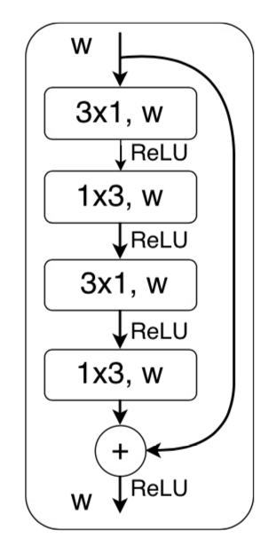
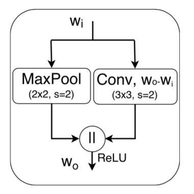
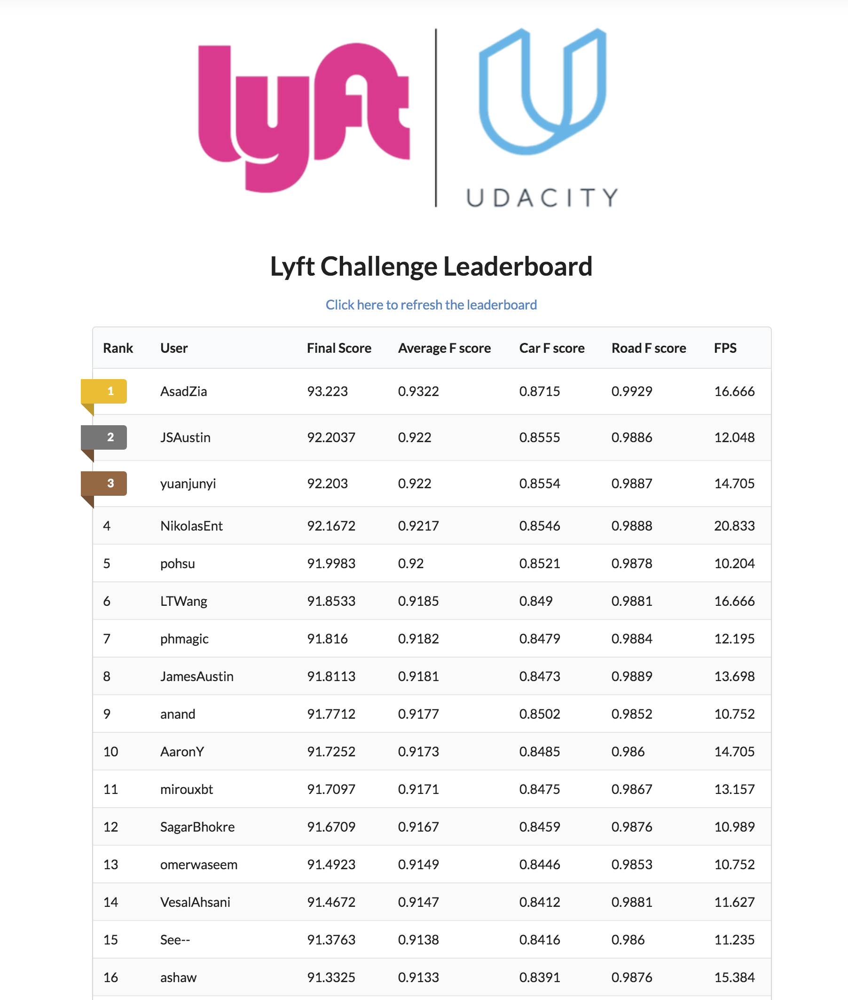

# The Lyft Perception Challenge

## Goal: 

The semantic segmentation of camera images from the CARLA simulation[1]. The categories to be labeled at the pixel-level are road surfaces and vehicles. The inference speed is a consideration as any algorithm with a speed of less than 10 frames per second is penalized. 

## Summary
* Framework: PyTorch
* Network Architecture used: ERFNet 
* Optmizer: ADAM
* Loss Function: Cross Entropy Loss
* Hyperparameters:
* Initial learning rate = 5e-04
* Batch size = 8
* Number of epochs = 100

## Details  
### Dataset Processing 

In addition to the sample dataset of 1000 provided from the project website, a dataset of 12600 was obtained by getting captures from the CARLA simulator. Most of the other captures were contributed by fellow competitors on the CarND Slack #lyftchallenge channel  (Thanks to chinkiat, faisall, and phmagic). It was clear from the dataset, that vehicle pixels were a very small portion of each image. The dataset was filtered out so that only images with greater than 2000 pixels of vehicles were included in the training set. This resulted in a training/validation dataset of 6405 pictures.

The data was then shuffled and split into 80% for the training set and 20% for the validation set. 

In the top and bottom of the picture is cropped out. The full dataset was analyzed and no vehicle or road pixels were found in the top 100 and the lower 60 pixels of the image. The resulting crop size is (440, 800).

### Data Augmentation
* Each image was randomly flipped in the horizontal direction with a probability of 0.5.
* Each image was randomly rotated by up to +/- 10 degrees.

### Network Architecture
The ERFNet convolution network[2] was used in this project. While doing the architecture search, other networks like FCN[4]. U-Net[5], and DeepLab V3+[6] were also considered. DeepLab v3+ is notable as it is the highest performing architecture in the Pascal VOC 2012 dataset for semantic segmentation. All 3 of these solutions are extremely slow to run a forward pass through. 

Recently, there have been a series of real time architectures for semantic segmentation. These include: ContextNet[8], ESPNet[9], ENet[7], and ERFnet[2]. ERFnet was chosen due to performance, speed, and the simplicity of the network.

The network uses a two major blocks: a Non-bottleneck 1D block and a Downsampler block. Both blocks are shown in diagrams below, which are taken from the ERFnet paper. The network is separated into two parts - the encoder and the decoder. The encoder consists of a combination of non-bottleneck 1D blocks and downsampler blocks. The decoder consists of upsampler blocks and non-bottleneck 1D blocks. 

#### Non-bottleneck 1D block:
Dropout is added at the end of every non-bottleneck 1-D block. After each combination of 3x1 and 1x3 convolutions, batch normalization is performed. Dilated convolutions of 2, 4, 8, and 16 are used in the network. Relu is used after the first 3 convolutions and at the end of the block. There's a residual connection between input of the block and the output of the block. 

#### Downsampler block:
This is the concatenation of a 3x3 convolution with a stride of 2 and a max-pooling module. 

#### Upsampling block
Just a 3x3 convolution with a stride of 2 and padding of 1. This is followed by batch normalization. 

#### High level list of Layers:
| Layer        | Block           | layer output channels  | output shape |
| ------------- |-------------|-----|----|
| 1      | downsampler block | 16 | 220x400 |
| 2      | downsampler block | 64 | 110x200 |
| 3-7    | 5x Non-bottleneck 1D block  |    64 | 110x200|
| 8      | downsampler block  | 128 | 55x100 |
| 9      | Non-bottleneck 1D block (dilated by 2) | 128 | 55x100 |
| 10     | Non-bottleneck 1D block (dilated by 4) | 128 | 55x100 |
| 11     | Non-bottleneck 1D block (dilated by 8) | 128 | 55x100 |
| 12     | Non-bottleneck 1D block (dilated by 16)| 128 | 55x100 |
| 13     | Non-bottleneck 1D block (dilated by 2) | 128 | 55x100 |
| 14     | Non-bottleneck 1D block (dilated by 4) | 128 | 55x100 |
| 15     | Non-bottleneck 1D block (dilated by 8) | 128 | 55x100 |
| 16     | Non-bottleneck 1D block (dilated by 16)| 128 | 55x100 |
| 17     | Upsampling block (deconv) | 64 | 110x200 |
| 18-19  | 2 x Non-bottleneck 1D block | 64 | 110x200 |
| 20     | Upsampling block (deconv) | 16 | 220x400 |
| 21-22  | 2 x Non-bottleneck 1D block | 16 | 220x400 |
| 23     | Upsampling block (deconv) | 3 | 440x800 |

Total number of params: 2,063,151

### Training
The weights are initialized to the default PyTorch value based on a uniform distribution. The ADAM optimizer is used with an initial learning rate of 5e-04. The learning rate is halved when the loss does not decrease for 3 epochs. The network was trained on the CARLA dataset for 100 epochs. The final learning rate is 5e-05. For the loss function, the weights are rescaled as 0.1 for the background, 0.5 for the road, and 2.0 for vehicles. This is done because of the imbalance between the road and the vehicle labels.

Training was done on a NVIDIA GTX1080, with a batch size of 8.

#### Other experiments:
1. Normalize the data by adjusting each image according to the mean and standard deviation of the dataset. This produced a extremely poor result.
2. Adjust the images by applying color jitter transform. The brightness, contrast, and saturation were randomly changed by up to 0.5. This did not hurt the results and did not improve the loss significantly. 
3. Adjust the images by moving the image by 0-2 pixels and then padding the empty side. This did not yield much improvement.  

## Result
10th on the leaderboard

#### Detailed Scoring 
Your program runs at 14.705 FPS

Car F score: 0.848 | Car Precision: 0.751 | Car Recall: 0.877 | Road F score: 0.986 | Road Precision: 0.985 | Road Recall: 0.989 | Averaged F score: 0.917

#### Leaderboard

## Reflections
I learned a lot completing this project. This is the first project that I used PyTorch. Data processing and augmentation were important. The ability to set up the pipeline quickly and iterate through various architectures, hyperparameters, or different sets of processed data was crucial.

The following could have been improved:
* Batch processing of images for inference to improve speed. This project only processed 1 frame at a time. In the original paper, ERFNet could achieve 83 FPS on a 640x360 resolution. 
* Training for more epochs. The ERFnet paper trained for 200-250 epochs to reach convergence vs 100 epochs in this project.  

## Versions of libraries used
opencv-python==3.4.0.14\
matplotlib==2.2.2\
numpy==1.14.3\
torch==0.4.0\
torchfile==0.1.0\
torchtext==0.2.3\
torchvision==0.2.1\
scikit-video==1.1.10\
scipy==1.1.0

## Example commands:
### Training after loading a pretrained model, assuming that your training images are under data/
`python3 train.py --device cuda --epochs 1 --batch_size 8 --savefile model_out.pth --loadfile model.pth --datadir "data"`

### Testing and scoring with an answer json file:
`python3 test.py test_video.py --output result.json`\
`python3 score.py --input result.json --answer_file Example/results.json`

## Citations:

[1] **"CARLA - Open-source simulator for autonomous driving"**
(http://carla.org/)

[2] **"Efficient ConvNet for Real-time Semantic Segmentation"**, E. Romera, J. M. Alvarez, L. M. Bergasa and R. Arroyo, IEEE Intelligent Vehicles Symposium (IV), pp. 1789-1794, Redondo Beach (California, USA), June 2017. 
**[Best Student Paper Award]**, [[pdf]](http://www.robesafe.uah.es/personal/eduardo.romera/pdfs/Romera17iv.pdf)

[3] **"ERFNet: Efficient Residual Factorized ConvNet for Real-time Semantic Segmentation"**, E. Romera, J. M. Alvarez, L. M. Bergasa and R. Arroyo, Transactions on Intelligent Transportation Systems (T-ITS), December 2017. [[pdf]](http://www.robesafe.uah.es/personal/eduardo.romera/pdfs/Romera17tits.pdf)

[4] **"Fully Convolutional Models for Semantic Segmentation"**, Evan Shelhamer*, Jonathan Long*, Trevor Darrell, PAMI 2016, arXiv:1605.06211 [[pdf]](https://arxiv.org/pdf/1605.06211)

[5] **"U-Net: Convolutional Networks for Biomedical Image Segmentation, Olaf Ronneberger"**, Philipp Fischer, Thomas Brox
Medical Image Computing and Computer-Assisted Intervention (MICCAI), Springer, LNCS, Vol.9351: 234--241, 2015, 
[[pdf]](https://arxiv.org/pdf/1505.04597.pdf)

[6] **"Encoder-Decoder with Atrous Separable Convolution for Semantic Image
Segmentation"**, Liang-Chieh Chen, Yukun Zhu, George Papandreou, Florian Schroff, Hartwig Adam.	arXiv:1802.02611, 2018 [[pdf]](https://arxiv.org/pdf/1802.02611)

[7] **"ENet: A Deep Neural Network Architecture for Real-Time Semantic Segmentation"**, Adam Paszke, Abhishek Chaurasia, Sangpil Kim, Eugenio Culurciello. arXiv:1606.02147, 2016 [[pdf]](https://arxiv.org/pdf/1606.02147)

[8] **"ContextNet: Exploring Context and Detail for Semantic Segmentation in Real-time"**, Rudra P K Poudel, Ujwal Bonde, Stephan Liwicki, Christopher Zach. arXiv:1805.04554, 2018 [[pdf]](https://arxiv.org/pdf/1805.04554)

[9] **"ESPNet: Efficient Spatial Pyramid of Dilated Convolutions for Semantic Segmentation"**, Sachin Mehta, Mohammad Rastegari, Anat Caspi, Linda Shapiro, and Hannaneh Hajishirzi. arXiv:1803.06815, 2018 [[pdf]](https://arxiv.org/pdf/1803.06815)